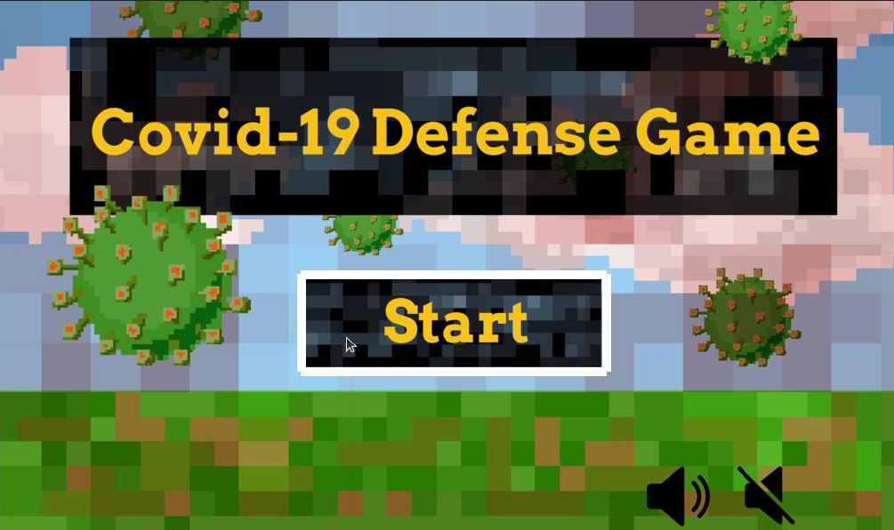
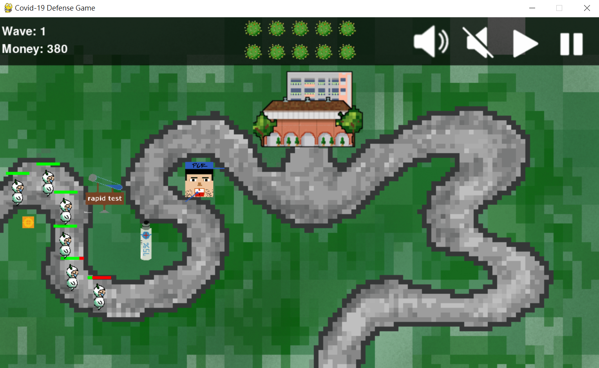

# Tower defense game 
=====
Step.06 Finish the simple tower defence game
-----
>Process
* Create the buttons that can play the music or mute the game when we click the corresponding button
  * The buttons can show a white frame when we move the cursor to the button

* Show the information on the black region

* When an enemy is killed, we get 15 unit of money; When an enemy reach the base, our hp drop 1 unit

Till now we have finished this simple tower defence game .
